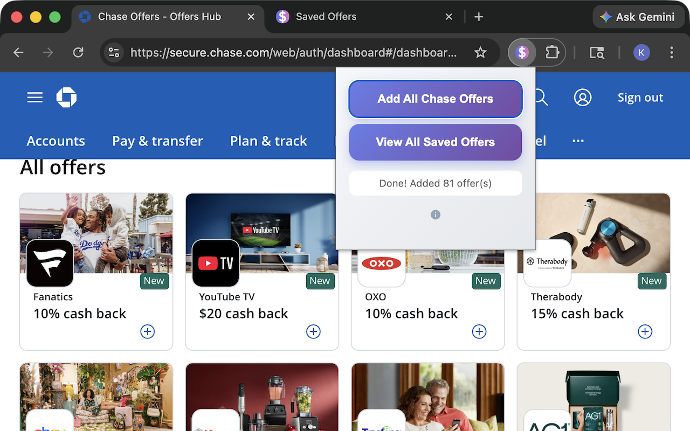
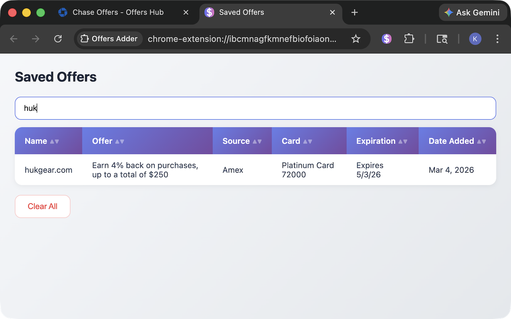

# Offers Adder

**Stop leaving free money on the table.** Offers Adder activates all your Chase and American Express card offers in one click — no more scrolling through pages and clicking "Add" fifty times.

## Install

| Browser | Link |
|---------|------|
| Chrome | [Chrome Web Store](https://chromewebstore.google.com/detail/offers-adder/lgnjjahmebcbjbbbhamofkiclbnecefn) |
| Firefox | [Firefox Add-ons](https://addons.mozilla.org/en-US/firefox/addon/offers-adder/) |
| Safari | Coming soon |

## How It Works

1. Log into your **Chase** or **Amex** account and go to the offers page
2. Click the Offers Adder icon in your toolbar
3. Hit the button — done. Every offer, added instantly.

That's it. No signup, no account, no data collected. It just clicks the buttons so you don't have to.

## Features

- **One click, all offers** — adds every available offer to your card(s) automatically
- **Chase + Amex** — works on both banks' offer pages
- **Saved Offers view** — browse and search all the offers you've added in one place
- **Running total** — tracks how many offers you've added over time

## Why?

Chase and Amex give you cash back, points, and statement credits through card-linked offers — but only if you manually add them first. Most people never bother because it takes forever to click through them all. This extension does it in about 3 seconds.

## Privacy

Offers Adder runs entirely in your browser. It doesn't collect, store, or send your data anywhere. The only permissions it needs are to interact with the offers pages you're already on.

## License

MIT
